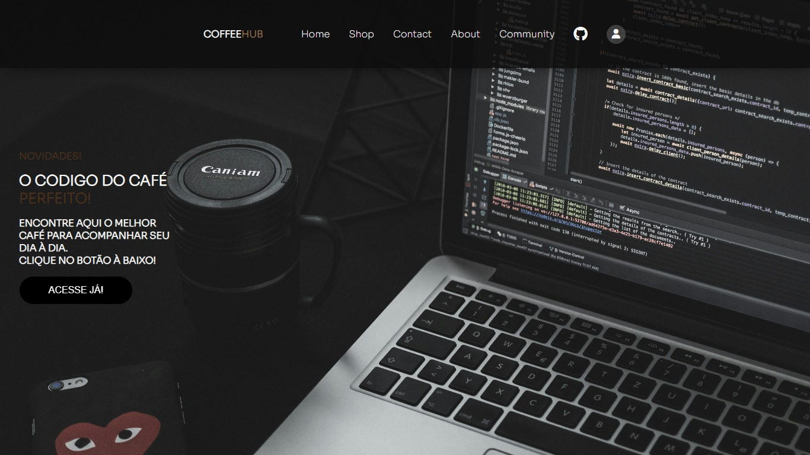

# ☕ CoffeHub Landing Page

Bem-vindo ao Coffehub!

## Versão Mobile

## Sobre o Projeto

Este é um projeto simples de uma landing page,Em andamento, para promover o melhor do CoffeHub , uma marca fictícia de café .

A página tem como objetivo cativar os amantes de café e desenvolvedores com sua estética acolhedora e informações sobre os produtos oferecidos.

## Tecnologias Utilizadas

- HTML5
- CSS
- JavaScript (para interações simples).

## Como Utilizar

1. Clone este repositório: `git clone https://github.com/seu_usuario/cafe-landing-page.git`
2. Abra o arquivo `index.html` no seu navegador web.
3. Explore a página e sinta-se à vontade para interagir com os elementos(no momento o projeto está em andamento).

## Contribuições

Contribuições são bem-vindas! Se você tem sugestões para melhorar este projeto, sinta-se à vontade para enviar um pull request. Juntos, podemos tornar esta landing page ainda mais incrível!

## Autor

Este projeto foi desenvolvido com ❤️ por [Enzo](https://github.com/EnzoCdutra).

